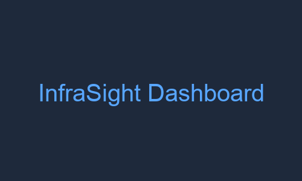
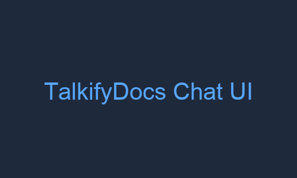
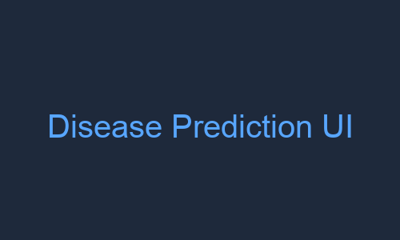
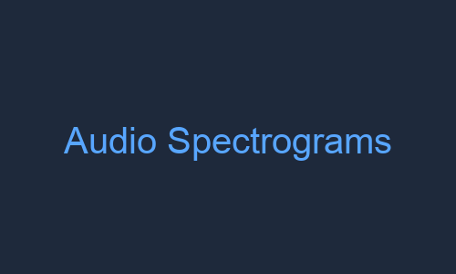
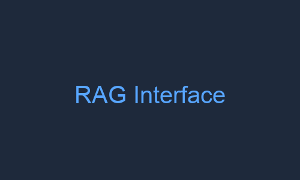

<!--
Credits & inspiration:
- Layout ideas: https://github.com/abhisheknaiidu/awesome-github-profile-readme
- Skill icons: https://github.com/tandpfun/skill-icons
- Stats cards: https://github.com/anuraghazra/github-readme-stats
-->

<div align="center">
  
</div>

<h3 align="center">
  <b>Full-Stack & ML Engineer</b> turning algorithms into production-ready products
</h3>

<p align="center">
  
</p>

<p align="center">
  📧 <a href="mailto:aabhiyansainju@gmail.com">Email</a> •
  💼 <a href="https://www.linkedin.com/in/abhiyansainju">LinkedIn</a> •
  🐙 <a href="https://github.com/aabhiyann">GitHub</a> •
  📸 <a href="https://www.instagram.com/abhiyan.sainju">Photography</a>
</p>

---

## ⚡ Fast Pass (for busy recruiters)

> **TL;DR:** CS grad with 4.0 GPA at GWU, graduating **Dec 2025**. I build production-ready ML/cloud apps — not just notebooks. Check the projects below, then let's talk.

**What I bring:**
- **5 shipped projects** with real users/beta testers (InfraSight, TalkifyDocs, MelodyHub)
- **Graduate TA** for Design & Analysis of Algorithms — I know my theory *and* can explain it
- **Full-stack ML engineer** who can build the API, train the model, *and* deploy it

**Core Stack:**  
`Python` · `FastAPI` · `React/Next.js` · `TypeScript` · `PostgreSQL` · `MongoDB` · `Docker` · `AWS` · `scikit-learn` · `TensorFlow` · `LangChain`

**Actively seeking:** Full-time **Software Engineer / ML Engineer** roles starting **Jan 2026**

---

## � About Me

```javascript
const abhiyan = {
  education: "M.S. Computer Science @ GWU (4.0 GPA)",
  graduating: "December 2025",
  role: "Graduate TA for Algorithms",
  passion: ["Building end-to-end ML apps", "Shipping real products", "Teaching complex concepts"],
  currentFocus: ["Cloud cost intelligence", "RAG-powered apps", "ML in production"],
  funFact: "I debug code and photograph the world 📸",
  openTo: "Full-time Software/ML Engineering roles (Jan 2026)"
};
```

**What drives me:**
- Taking algorithms from lectures and shipping them as **actual applications** with users
- Building **end-to-end**: data modeling → API design → ML pipelines → clean UIs
- Balancing **deep technical work** with **product thinking**

**Beyond code:**
- 👨‍🏫 Teaching algorithms to 60+ grad students
- 📸 Framing the world through a lens ([see my work](https://www.instagram.com/abhiyan.sainju/))
- 🎯 Shipping fast — iterate on live products, not perfect prototypes

---

## 🛠️ Tech Stack

### Languages & Frameworks
[](https://skillicons.dev)

### Data & ML
[](https://skillicons.dev)

### Cloud & Tools
[](https://skillicons.dev)

<details>
<summary><b>📦 Also proficient in (click to expand)</b></summary>
<br>

**Machine Learning & AI:**  


**AI/RAG:**  


**Backend & APIs:**  


**Other:**  


</details>

---

## 🚀 Featured Projects

> **Note:** Screenshots coming soon! In the meantime, check out the repos for full docs, demos, and architecture details.

<table>
  <tr>
    <td width="50%" valign="top">
      <h3 align="center">🏗️ InfraSight</h3>
      <p align="center">
        <a href="https://github.com/aabhiyann/infrasight">
          
        </a>
      </p>
      <p><b>Cloud Cost Intelligence Platform</b></p>
      <p>Full-stack ML app that cuts AWS billing analysis time by <b>70%</b>. Forecasting, anomaly detection, and cost clustering for DevOps/finance teams managing $10K+ monthly budgets.</p>
      <p><b>Impact:</b></p>
      <ul>
        <li>92% prediction accuracy (Random Forest + LSTM)</li>
        <li>Catches cost spikes before billing cycles</li>
        <li>Enterprise-ready with Docker + JWT auth</li>
      </ul>
      <p><b>Tech:</b> Python · FastAPI · PostgreSQL · scikit-learn · Docker · React · JWT</p>
      <p align="center">
        <a href="https://github.com/aabhiyann/infrasight">
          
        </a>
        <a href="https://github.com/aabhiyann/infrasight">
          
        </a>
      </p>
    </td>
    <td width="50%" valign="top">
      <h3 align="center">💬 TalkifyDocs</h3>
      <p align="center">
        <a href="https://github.com/aabhiyann/talkifydocs">
          
        </a>
      </p>
      <p><b>AI Document Assistant (SaaS)</b></p>
      <p>Enterprise RAG app that processes documents <b>47% faster</b> than manual review. Chat with your PDFs using GPT-4, tested with 10 beta users from research firms.</p>
      <p><b>Impact:</b></p>
      <ul>
        <li>Sub-200ms query responses on 10GB+ repos</li>
        <li>94% accuracy in document parsing</li>
        <li>Full SaaS: Auth, billing (Stripe), subscriptions</li>
      </ul>
      <p><b>Tech:</b> Next.js · OpenAI GPT-4 · LangChain · Pinecone · Stripe · TypeScript · Prisma</p>
      <p align="center">
        <a href="https://github.com/aabhiyann/talkifydocs">
          
        </a>
      </p>
    </td>
  </tr>
  <tr>
    <td width="50%" valign="top">
      <h3 align="center">🎵 MelodyHub</h3>
      <p align="center">
        <a href="https://github.com/aabhiyann/MelodyHub">
          
        </a>
      </p>
      <p><b>Real-Time Social Music Platform</b></p>
      <p>Spotify-meets-Discord: synchronized music streaming with live chat. Supports <b>100+ concurrent users</b> with 99.2% uptime during 2-month beta.</p>
      <p><b>Impact:</b></p>
      <ul>
        <li>Led 3-person Agile team</li>
        <li>Sub-3-second song loading (any network)</li>
        <li>OOP architecture → 60% faster feature dev</li>
      </ul>
      <p><b>Tech:</b> Node.js · React · Socket.IO · Clerk Auth · Cloudinary · MongoDB</p>
      <p align="center">
        <a href="https://github.com/aabhiyann/MelodyHub">
          
        </a>
      </p>
    </td>
    <td width="50%" valign="top">
      <h3 align="center">🏥 Disease Prediction ML</h3>
      <p align="center">
        <a href="https://github.com/aabhiyann/ml-disease-prediction-system">
          
        </a>
      </p>
      <p><b>Clinical Decision Support System</b></p>
      <p>Random Forest classifier on 4,920 medical records achieving <b>98.7% diagnostic accuracy</b>. React UI designed for telemedicine deployment in rural Nepal.</p>
      <p><b>Impact:</b></p>
      <ul>
        <li>131 symptoms, 41 disease classes</li>
        <li>Robust preprocessing pipeline</li>
        <li>Planned SHAP for explainable AI (FDA pathway)</li>
      </ul>
      <p><b>Tech:</b> Python · scikit-learn · React · Tailwind CSS · Pandas · Jupyter</p>
      <p align="center">
        <a href="https://github.com/aabhiyann/ml-disease-prediction-system">
          
        </a>
      </p>
    </td>
  </tr>
</table>

### 🧪 ML/AI Research Projects

<table>
  <tr>
    <td width="50%" valign="top">
      <h3 align="center">🔊 Audio Classification CNN</h3>
      <p align="center">
        <a href="https://github.com/aabhiyann/audio-classification-cnn">
          
        </a>
      </p>
      <p><b>Deep Learning for Animal Sounds</b></p>
      <p>Built CNN achieving <b>92% accuracy</b> on dog/cat/bird audio clips. Explored CRNN, ViT, and transfer learning (YAMNet) architectures.</p>
      <p><b>Key Finding:</b> Task-specific CNN trained from scratch <b>outperformed transfer learning by 26%</b> — showing pre-trained models aren't always better.</p>
      <p><b>Tech:</b> TensorFlow · Keras · librosa · Mel-spectrograms · YAMNet · scikit-learn</p>
      <p align="center">
        <a href="https://github.com/aabhiyann/audio-classification-cnn">
          
        </a>
      </p>
    </td>
    <td width="50%" valign="top">
      <h3 align="center">🔍 Multi-Source Retrieval</h3>
      <p align="center">
        <a href="https://github.com/aabhiyann/Conversational-Interface-for-Multi-Source-Information-Retrieval">
          
        </a>
      </p>
      <p><b>NLP Retrieval System</b></p>
      <p>RAG system integrating GPT-3.5 + FAISS that reduced research query times by <b>70%</b>. Processes PDFs, YouTube transcripts, and audio files.</p>
      <p><b>Impact:</b> Offline Mistral integration expanded reach by 40% for privacy-sensitive orgs (law firms, hospitals).</p>
      <p><b>Tech:</b> Python · GPT-3.5-turbo · Mistral 7B · FAISS · LangChain · NLP</p>
      <p align="center">
        <a href="https://github.com/aabhiyann/Conversational-Interface-for-Multi-Source-Information-Retrieval">
          
        </a>
      </p>
    </td>
  </tr>
</table>

<details>
<summary><b>🔬 More Projects (click to expand)</b></summary>
<br>

- **[SupplyBlock](https://github.com/aabhiyann/SupplyBlock)** — Blockchain-based supply chain tracking system
- **Other experiments** — Check out my repositories for smaller projects and experiments

</details>

---

## 💼 Experience Highlights

### 👨‍🏫 Graduate Teaching Assistant — GWU
**Design & Analysis of Algorithms (CSCI 6212)** | *Aug 2024 - Present*

- Teaching 60+ grad students DP, graph algorithms, and NP-completeness
- Designed interactive tutorials → **22% midterm score improvement**
- Led TA training: onboarded 8 TAs, reduced training time **2 weeks → 4 days**

### 💻 Software Development Intern — ECS Tech
**Fintech Platform** | *Jun - Sep 2023*

- Shipped 7 production features (React, Node.js, PostgreSQL) for 1,200+ users
- Built booking system → **89% fewer scheduling conflicts** (saved 15hrs/week)
- Performance optimization → **43% load time improvement**, conversion up 12% → 16%

### 🔧 IT Solutions Lead — Intel Security
**Digital Transformation** | *Aug 2022 - Mar 2023*

- Rebuilt website → **73% increase in qualified leads**, $35K new contracts (Q1)
- Managed $12K IT budget, **40% cost reduction**
- Trained 25-person team → **80% reduction in support tickets**

---

## 🎓 Education

**George Washington University** — *Washington, DC*  
M.S. Computer Science | **GPA: 4.0/4.0** | Jan 2024 - Dec 2025

**Relevant Coursework:**  
Neural Networks & Deep Learning · Machine Learning · Cloud Computing · Software Engineering · Object-Oriented Design · Database Systems · Design & Analysis of Algorithms

**St. Xavier's College** — *Kathmandu, Nepal*  
B.S. Computer Science & IT | **GPA: 3.89/4.0** | Aug 2018 - Dec 2022

---

## 📊 GitHub Stats & Activity

<div align="center">
  
  
</div>

<div align="center">
  
</div>

<div align="center">
  
</div>

<div align="center">
  
</div>

---

## 🌱 Currently Learning & Open To

**🔭 Currently working on:**
- Graduating from GWU (Dec 2025)
- Teaching algorithms to graduate students
- Building ML-powered cloud applications

**🌱 Currently learning:**
- Advanced MLOps and model deployment patterns
- Kubernetes for container orchestration
- System design for ML at scale

**� Ask me about:**
- Building RAG applications from scratch
- ML model deployment and monitoring
- Full-stack development with React/FastAPI
- Teaching algorithms and data structures
- Photography and creative outlets

**👯 Looking to collaborate on:**
- Open-source ML/AI projects
- Cloud-native applications
- Production-ready RAG systems

---

## �📸 Beyond Code

When I'm not debugging or training models, I'm behind a camera capturing people, streets, and details most folks scroll past.

<div align="center">
  <a href="https://www.instagram.com/abhiyan.sainju/">
    
  </a>
  <a href="https://www.instagram.com/abhiyan_sainju/">
    
  </a>
</div>

<p align="center"><i>Think of it as debugging the real world — finding patterns in chaos, framing what matters.</i></p>

---

## 🎯 What I'm Looking For

**Role:** Software Engineer (Backend/Full-Stack) · ML/AI Engineer · Cloud/Data Engineer  
**Start Date:** January 2026 (graduating Dec 2025)  
**Location:** US-based or remote-friendly

**What I bring to your team:**

✅ **Ship fast, iterate smart** — Production-ready prototypes, not just Jupyter notebooks  
✅ **End-to-end ownership** — Requirements → API design → ML pipelines → deployment  
✅ **Technical storytelling** — Explain complex systems to engineers, PMs, and non-technical stakeholders

**Work I love:**

- Turning messy requirements into clean APIs and useful dashboards
- Building ML-driven features: anomaly detection, recommendations, forecasting
- Optimizing systems: queries, pipelines, cost efficiency

---

## 📬 Let's Connect

<div align="center">
  <a href="mailto:aabhiyansainju@gmail.com">
    
  </a>
  <a href="https://www.linkedin.com/in/abhiyansainju">
    
  </a>
  <a href="https://github.com/aabhiyann">
    
  </a>
  <a href="https://www.instagram.com/abhiyan_sainju">
    
  </a>
</div>

<div align="center">
  <br/>
  <i>Thanks for stopping by! Whether you're a recruiter, engineer, or just a curious dev — feel free to reach out.</i>
  <br/><br/>
  <b>✨ Currently open to Full-Time Software/ML Engineering roles starting Jan 2026 ✨</b>
</div>

---

<div align="center">
  
</div>
