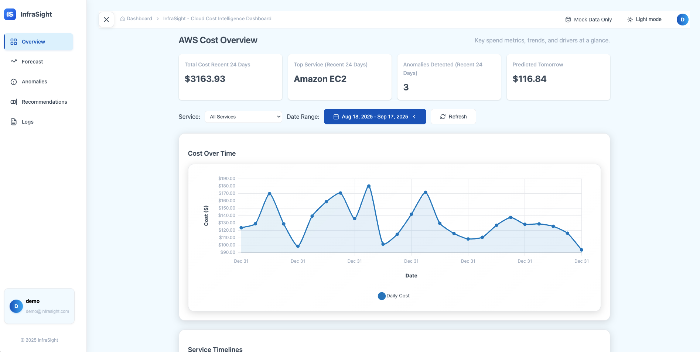
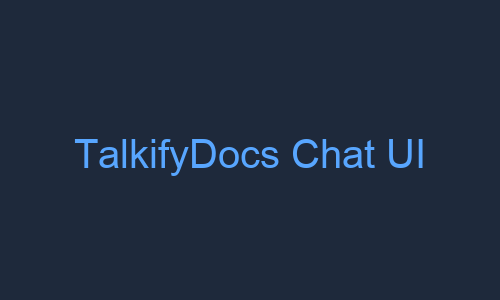
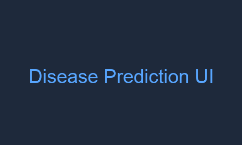
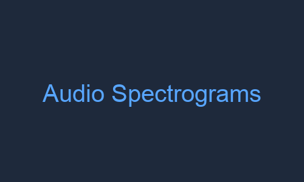
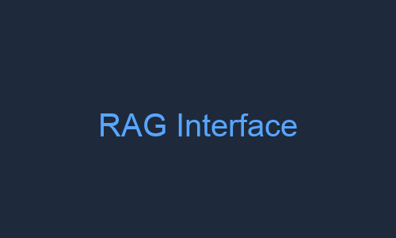

<!--
Credits & inspiration:
- Layout ideas: https://github.com/abhisheknaiidu/awesome-github-profile-readme
- Skill icons: https://github.com/tandpfun/skill-icons
- Stats cards: https://github.com/anuraghazra/github-readme-stats
-->

<div align="center">
  
</div>

<h3 align="center">
  <b>Full-Stack & ML Engineer</b> turning algorithms into production-ready products
</h3>

<p align="center">
  
</p>

<p align="center">
  📧 <a href="mailto:aabhiyansainju@gmail.com">Email</a> •
  💼 <a href="https://www.linkedin.com/in/abhiyansainju">LinkedIn</a> •
  🐙 <a href="https://github.com/aabhiyann">GitHub</a> •
  📸 <a href="https://www.instagram.com/abhiyan.sainju">Photography</a>
</p>

<p align="center">
  <a href="#fast-pass-for-busy-recruiters">Fast Pass</a> •
  <a href="#featured-projects">Projects</a> •
  <a href="#tech-stack">Skills</a> •
  <a href="#experience-highlights">Experience</a> •
  <a href="#lets-connect">Contact</a>
</p>

---

## Fast Pass (for busy recruiters)

> **TL;DR:** Recent CS graduate with 4.0 GPA from GWU (Dec 2025). I build production-ready ML/cloud apps — not just notebooks. Check the projects below, then let's talk.

**What I bring:**
- **5 shipped projects** with real users/beta testers (InfraSight, TalkifyDocs, MelodyHub)
- **Graduate TA** for Design & Analysis of Algorithms — I know my theory *and* can explain it
- **Full-stack ML engineer** who can build the API, train the model, *and* deploy it

**Core Stack:**  
`Python` · `FastAPI` · `React/Next.js` · `TypeScript` · `PostgreSQL` · `MongoDB` · `Docker` · `AWS` · `scikit-learn` · `TensorFlow` · `LangChain`

**Actively seeking:** Full-time **Software Engineer / ML Engineer** roles (available immediately)

📬 **Best way to reach me:** [Email](mailto:aabhiyansainju@gmail.com) · [LinkedIn](https://www.linkedin.com/in/abhiyansainju)

---

## About Me

```javascript
const abhiyan = {
  education: "M.S. Computer Science @ GWU (4.0 GPA)",
  graduated: "December 2025",
  role: "Graduate TA for Algorithms",
  passion: ["Building end-to-end ML apps", "Shipping real products", "Teaching complex concepts"],
  currentFocus: ["Cloud cost intelligence", "RAG-powered apps", "ML in production"],
  funFact: "I debug code and photograph the world 📸",
  openTo: "Full-time Software/ML Engineering roles (available immediately)"
};
```

**What drives me:**
- Taking algorithms from lectures and shipping them as **actual applications** with users
- Building **end-to-end**: data modeling → API design → ML pipelines → clean UIs
- Balancing **deep technical work** with **product thinking**

**Beyond code:**
- 👨‍🏫 Teaching algorithms to 60+ grad students
- 📸 Framing the world through a lens ([see my work](https://abhiyansainju.com/photography) | [Instagram](https://www.instagram.com/abhiyan.sainju/))
- 🎯 Shipping fast — iterate on live products, not perfect prototypes

---

## Tech Stack

### Languages & Frameworks
[](https://skillicons.dev)

### Data & ML
[](https://skillicons.dev)

### Cloud & Tools
[](https://skillicons.dev)

<details>
<summary><b>📦 Also proficient in (click to expand)</b></summary>
<br>

**Machine Learning & AI:**  


**AI/RAG:**  


**Backend & APIs:**  


**Other:**  


</details>

---

## Featured Projects

> **💡 Tip:** Screenshots coming soon! In the meantime, check out the repos for full docs, demos, and architecture details.  
> **📌 Note:** Don't forget to check my [Pinned Repositories](https://github.com/aabhiyann?tab=repositories) below for more projects!

### Production-Ready Applications

<table>
  <tr>
    <td width="50%" valign="top">
      <h3 align="center">InfraSight</h3>
      <div align="center">
        <a href="https://github.com/aabhiyann/infrasight">
          
        </a>
      </div>
      <br>
      <p><b>Cloud Cost Intelligence Platform</b></p>
      <p>Full-stack ML app that cuts AWS billing analysis time by <b>70%</b>. Forecasting, anomaly detection, and cost clustering for DevOps/finance teams managing $10K+ monthly budgets.</p>
      <p><b>Impact:</b></p>
      <ul>
        <li>✅ 92% prediction accuracy (Random Forest + LSTM)</li>
        <li>✅ Catches cost spikes before billing cycles</li>
        <li>✅ Enterprise-ready with Docker + JWT auth</li>
      </ul>
      <p><b>Tech:</b> Python · FastAPI · PostgreSQL · scikit-learn · Docker · React · JWT</p>
      <div align="center">
        <a href="https://github.com/aabhiyann/infrasight">
          
        </a>
        <a href="https://infrasight.netlify.app/">
          
        </a>
      </div>
    </td>
    <td width="50%" valign="top">
      <h3 align="center">TalkifyDocs</h3>
      <div align="center">
        <a href="https://github.com/aabhiyann/talkifydocs">
          
        </a>
      </div>
      <br>
      <p><b>AI Document Assistant (SaaS)</b></p>
      <p>Enterprise RAG app that processes documents <b>47% faster</b> than manual review. Chat with your PDFs using GPT-4, tested with 10 beta users from research firms.</p>
      <p><b>Impact:</b></p>
      <ul>
        <li>✅ Sub-200ms query responses on 10GB+ repos</li>
        <li>✅ 94% accuracy in document parsing</li>
        <li>✅ Full SaaS: Auth, billing (Stripe), subscriptions</li>
      </ul>
      <p><b>Tech:</b> Next.js · OpenAI GPT-4 · LangChain · Pinecone · Stripe · TypeScript · Prisma</p>
      <div align="center">
        <a href="https://github.com/aabhiyann/talkifydocs">
          
        </a>
        <a href="https://talkifydocs.vercel.app">
          
        </a>
      </div>
    </td>
  </tr>
  <tr>
    <td width="50%" valign="top">
      <h3 align="center">MelodyHub</h3>
      <div align="center">
        <a href="https://github.com/aabhiyann/MelodyHub">
          
        </a>
      </div>
      <br>
      <p><b>Real-Time Social Music Platform</b></p>
      <p>Spotify-meets-Discord: synchronized music streaming with live chat. Served <b>100+ beta users during 2-month trial</b> at GWU with 99.2% uptime.</p>
      <p><b>Impact:</b></p>
      <ul>
        <li>✅ Led 3-person Agile team</li>
        <li>✅ Sub-3-second song loading (any network)</li>
        <li>✅ OOP architecture → 60% faster feature dev</li>
      </ul>
      <p><b>Tech:</b> Node.js · React · Socket.IO · Clerk Auth · Cloudinary · MongoDB</p>
      <div align="center">
        <a href="https://github.com/aabhiyann/MelodyHub">
          
        </a>
        <a href="https://udaymelodyhhub.vercel.app/">
          
        </a>
      </div>
    </td>
    <td width="50%" valign="top">
      <h3 align="center">Disease Prediction ML</h3>
      <div align="center">
        <a href="https://github.com/aabhiyann/ml-disease-prediction-system">
          
        </a>
      </div>
      <br>
      <p><b>Clinical Decision Support System</b></p>
      <p>Random Forest classifier on 4,920 medical records achieving <b>98.7% diagnostic accuracy</b>. React UI designed for telemedicine deployment in rural Nepal.</p>
      <p><b>Impact:</b></p>
      <ul>
        <li>✅ 131 symptoms, 41 disease classes</li>
        <li>✅ Robust preprocessing pipeline</li>
        <li>✅ Planned SHAP for explainable AI (FDA pathway)</li>
      </ul>
      <p><b>Tech:</b> Python · scikit-learn · React · Tailwind CSS · Pandas · Jupyter</p>
      <div align="center">
        <a href="https://github.com/aabhiyann/ml-disease-prediction-system">
          
        </a>
      </div>
    </td>
  </tr>
</table>

### ML/AI Research Projects

<table>
  <tr>
    <td width="50%" valign="top">
      <h3 align="center">Audio Classification CNN</h3>
      <div align="center">
        <a href="https://github.com/aabhiyann/audio-classification-cnn">
          
        </a>
      </div>
      <br>
      <p><b>Deep Learning for Animal Sounds</b></p>
      <p>Built CNN achieving <b>92% accuracy</b> on dog/cat/bird audio clips. Explored CRNN, ViT, and transfer learning (YAMNet) architectures.</p>
      <p><b>Key Finding:</b> Task-specific CNN trained from scratch <b>outperformed transfer learning by 26%</b> — showing pre-trained models aren't always better.</p>
      <p><b>Tech:</b> TensorFlow · Keras · librosa · Mel-spectrograms · YAMNet · scikit-learn</p>
      <div align="center">
        <a href="https://github.com/aabhiyann/audio-classification-cnn">
          
        </a>
      </div>
    </td>
    <td width="50%" valign="top">
      <h3 align="center">Multi-Source Retrieval</h3>
      <div align="center">
        <a href="https://github.com/aabhiyann/Conversational-Interface-for-Multi-Source-Information-Retrieval">
          
        </a>
      </div>
      <br>
      <p><b>NLP Retrieval System</b></p>
      <p>RAG system integrating GPT-3.5 + FAISS that reduced research query times by <b>70%</b>. Processes PDFs, YouTube transcripts, and audio files.</p>
      <p><b>Impact:</b> Offline Mistral integration expanded reach by 40% for privacy-sensitive orgs (law firms, hospitals).</p>
      <p><b>Tech:</b> Python · GPT-3.5-turbo · Mistral 7B · FAISS · LangChain · NLP</p>
      <div align="center">
        <a href="https://github.com/aabhiyann/Conversational-Interface-for-Multi-Source-Information-Retrieval">
          
        </a>
      </div>
    </td>
  </tr>
</table>

<details>
<summary><b>🔬 More Projects (click to expand)</b></summary>
<br>

**Blockchain & Systems:**
- **[SupplyBlock](https://github.com/aabhiyann/SupplyBlock)** — Blockchain-based supply chain tracking system

**Experiments & Learning:**
- Check out my [repositories](https://github.com/aabhiyann?tab=repositories) for smaller projects, course assignments, and experiments

</details>

---

## Experience Highlights

### Graduate Teaching Assistant — George Washington University
**Design & Analysis of Algorithms (CSCI 6212)** | *Aug 2024 - Present* | *Washington, DC*

- Teaching 60+ grad students dynamic programming, graph algorithms, and NP-completeness
- Designed interactive tutorials translating theory into industry case studies → **22% midterm score improvement**
- Led TA training program: onboarded 8 new TAs, reduced training time from **2 weeks → 4 days**

### Software Development Intern — ECS Tech
**Fintech Platform Development** | *Jun 2023 - Sep 2023* | *Lalitpur, Nepal*

- Shipped 7 production features (React, Node.js, PostgreSQL) for 1,200+ active users
- Built automated booking system → eliminated **89% of scheduling conflicts** (saved 15hrs/week for support)
- Led performance optimization → **43% load time improvement**, conversion rates increased **12% → 16%**

### IT Solutions Lead — Intel Security Service Pvt. Ltd.
**Digital Transformation & Infrastructure** | *Aug 2022 - Mar 2023* | *Kathmandu, Nepal*

- Rebuilt legacy website into lead-gen platform → **73% increase in qualified leads**, $35K new contracts (Q1)
- Managed $12K annual IT budget as sole technical decision-maker → **40% operational cost reduction**
- Trained 25-employee team, developed documentation → **80% reduction in external support tickets**

---

## Education

**George Washington University** — *Washington, DC*  
Master of Science in Computer Science | **GPA: 4.0/4.0** | *Jan 2024 - Dec 2025* (Graduated)

**Relevant Coursework:**  
Neural Networks & Deep Learning · Machine Learning · Cloud Computing · Software Engineering · Object-Oriented Design · Database Systems · Design & Analysis of Algorithms

**St. Xavier's College** — *Kathmandu, Nepal*  
Bachelor of Science in Computer Science & Information Technology | **GPA: 3.89/4.0** | *Aug 2018 - Dec 2022*

---

## GitHub Stats & Activity

<!-- START_SECTION:stats -->

<div align="center">
  
  
</div>


<div align="center">
  
</div>


<div align="center">
  
</div>

<!-- END_SECTION:stats -->

---

## Beyond Code

When I'm not debugging or training models, I'm behind a camera capturing people, streets, and details most folks scroll past.

<div align="center">
  <a href="https://abhiyansainju.com/photography">
    
  </a>
  <a href="https://www.instagram.com/abhiyan.sainju/">
    
  </a>
  <a href="https://www.instagram.com/abhiyan_sainju/">
    
  </a>
</div>

<p align="center"><i>Think of it as debugging the real world — finding patterns in chaos, framing what matters.</i></p>

---

## What I'm Looking For

<table>
  <tr>
    <td valign="top" width="50%">
      <h3>🎯 Target Roles</h3>
      <ul>
        <li>Software Engineer (Backend/Full-Stack)</li>
        <li>ML/AI Engineer</li>
        <li>Cloud/Data Engineer</li>
      </ul>
      <p><b>Start Date:</b> Available immediately (graduated Dec 2025)<br>
      <b>Location:</b> US-based or remote-friendly</p>
    </td>
    <td valign="top" width="50%">
      <h3>✨ What I Bring</h3>
      <ul>
        <li><b>Ship fast, iterate smart</b> — Production prototypes, not just notebooks</li>
        <li><b>End-to-end ownership</b> — From requirements to deployment</li>
        <li><b>Technical storytelling</b> — Bridge technical and non-technical stakeholders</li>
      </ul>
    </td>
  </tr>
</table>

**Work I love:**
- Turning messy requirements into clean APIs and useful dashboards
- Building ML-driven features: anomaly detection, recommendations, forecasting
- Optimizing systems: queries, pipelines, cost efficiency

---

## Let's Connect

<div align="center">
  <a href="mailto:aabhiyansainju@gmail.com">
    
  </a>
  <a href="https://www.linkedin.com/in/abhiyansainju">
    
  </a>
  <a href="https://github.com/aabhiyann">
    
  </a>
  <a href="https://www.instagram.com/abhiyan_sainju">
    
  </a>
</div>

<br>

<div align="center">
  <table>
    <tr>
      <td align="center">
        <b>📧 Best Contact Method</b><br>
        Email or LinkedIn
      </td>
      <td align="center">
        <b>⏱️ Response Time</b><br>
        Usually within 24 hours
      </td>
      <td align="center">
        <b>🕐 Time Zone</b><br>
        EST (Washington, DC)
      </td>
    </tr>
  </table>
</div>

<div align="center">
  <br>
  <i>Thanks for stopping by! Whether you're a recruiter, engineer, or just a curious dev — feel free to reach out.</i>
  <br><br>
  <b>✨ Currently open to Full-Time Software/ML Engineering roles ✨</b>
</div>
